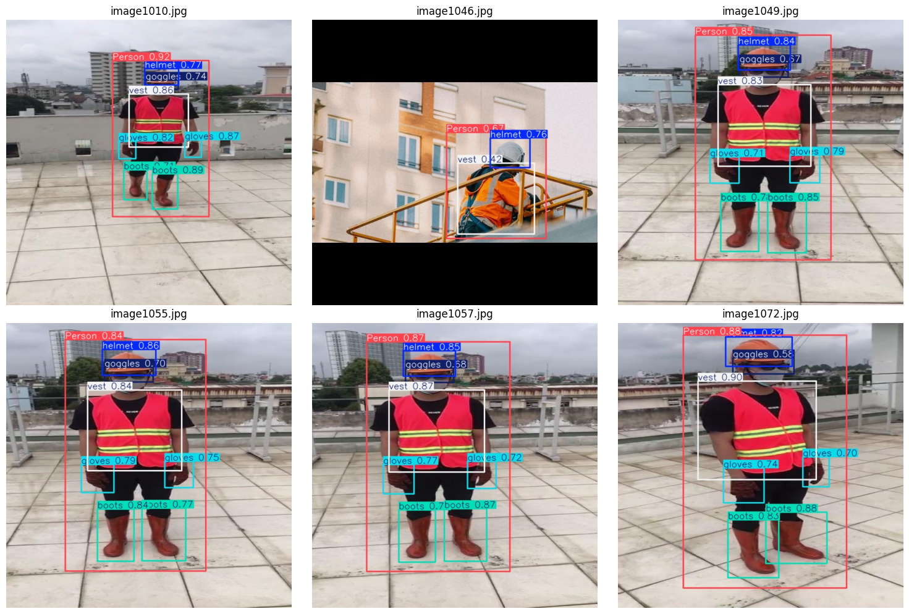
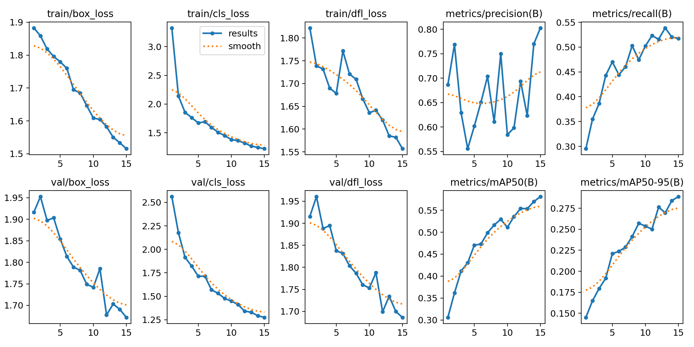
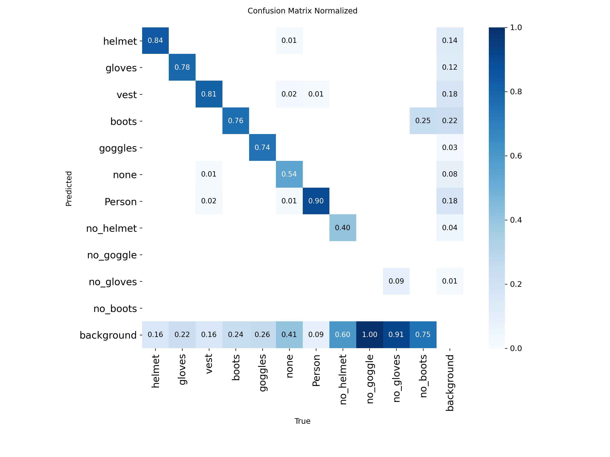

# PPE Object Detection with YOLO11n

**Computer Vision Bootcamp – Saudi Digital Academy × atomcamp Arabia**

**Project Date:** July 2026

An end-to-end object detection pipeline that identifies personal protective equipment (PPE) and safety violations in construction-site images — fine-tuned, evaluated, and diagnosed using **YOLO11n**.

The project focuses not only on training a detector, but also on dataset auditing, annotation visualization, per-class evaluation, confusion-matrix analysis, and understanding why some classes fail.

---

## 🧠 Key Skills Demonstrated

- Built a complete object detection workflow: dataset audit → annotation visualization → transfer learning → evaluation → failure analysis
- Implemented Intersection over Union (IoU) manually to understand bounding-box evaluation beyond library calls
- Fine-tuned a pretrained YOLO11n model on an 11-class construction PPE dataset
- Evaluated the model using Precision, Recall, mAP, per-class metrics, and a normalized confusion matrix
- Identified class imbalance as a major contributor to weak minority-class performance
- Distinguished between a working educational prototype and a deployment-ready safety system

---

## 🔍 Project Overview

The system answers two questions:

1. **What object is present?**
2. **Where is it located?**

Unlike image classification, which predicts one label for the entire image, object detection can identify multiple objects and locate each one using bounding boxes.

The model detects 11 classes:

`helmet` · `gloves` · `vest` · `boots` · `goggles` · `none` · `Person` · `no_helmet` · `no_goggle` · `no_gloves` · `no_boots`

---

## ✏️ My Work

- Prepared the project folders and YOLO dataset configuration
- Audited image and annotation-file counts
- Read and decoded YOLO bounding-box labels
- Visualized ground-truth annotations using OpenCV and Matplotlib
- Implemented IoU manually
- Loaded a pretrained YOLO11n checkpoint
- Fine-tuned the model using transfer learning
- Evaluated overall and per-class performance
- Analyzed the normalized confusion matrix
- Ran inference on unseen validation images
- Investigated weak classes and dataset limitations

---

## ⚙️ Project Constraints

This project was completed during a four-day bootcamp and was intentionally scoped for learning under limited resources.

| Setting | Value |
|---|---|
| Model | YOLO11n |
| Training Method | Transfer Learning |
| Epochs | 15 |
| Image Size | 640 × 640 |
| Batch Size | 8 |
| Early-Stopping Patience | 5 |
| Hardware | CPU |
| Prediction Threshold | 0.35 |

These constraints provide important context for interpreting the results and planning the next iteration.

---

## 📂 Dataset

| Split | Images | Label Files |
|---|---:|---:|
| Training | 1,132 | 1,142 |
| Validation | 143 | 143 |
| Test | 141 | 141 |

The training split contains 10 more label files than images. This may indicate unmatched annotation files and should be verified during dataset cleaning.

---

## 📊 Overall Results

| Metric | Score |
|---|---:|
| Precision | 0.803 |
| Recall | 0.517 |
| mAP@0.50 | 0.581 |
| mAP@0.50:0.95 | 0.289 |

The model achieved good overall Precision, meaning that many reported detections were correct.

Recall was lower, showing that the model still missed a meaningful number of real objects. These misses were concentrated mainly in underrepresented classes.

---

## 🔎 Prediction Examples

The model successfully detected multiple PPE items and their locations within the same image, including persons, helmets, goggles, vests, gloves, and boots.

These examples mainly show successful predictions from the stronger and more frequent classes. The confusion matrix below provides a more complete view of the model's limitations.



---

## 🚧 Main Finding: Class Imbalance Contributed to Weak Class Performance

The dataset is imbalanced, meaning that some classes are represented much more heavily than others.

The validation distribution and per-class metrics show a clear gap between frequent PPE classes and rare missing-PPE classes:

| Class | Validation Instances | Recall |
|---|---:|---:|
| Person | 239 | 0.908 |
| helmet | 201 | 0.833 |
| vest | 171 | 0.819 |
| no_helmet | 45 | 0.333 |
| no_goggle | 41 | 0.000 |
| no_gloves | 56 | 0.089 |
| no_boots | 4 | 0.000 |

The normalized confusion matrix shows that many minority-class objects were predicted as background:

- `no_goggle`: 100% missed as background
- `no_gloves`: 91% missed as background
- `no_boots`: 75% missed as background
- `no_helmet`: 60% missed as background

These results strongly suggest that limited and uneven class representation was a major contributor to the weak performance.

Other possible contributors include:

- Small object sizes
- Annotation quality
- Visually overlapping classes
- The ambiguous `none` class
- Limited training time and compute

---

## 🛠️ Proposed Next Steps

Ordered roughly by expected impact:

1. **Collect more examples for minority classes**
2. **Review unmatched image and label files**
3. **Audit bounding boxes and class IDs**
4. **Apply targeted augmentation to rare classes**
5. **Use copy-paste augmentation for small PPE items**
6. **Oversample images containing missing-PPE cases**
7. **Reconsider the definition of the `none` class**
8. **Train for more epochs using a GPU**
9. **Compare YOLO11n with a larger YOLO model after improving the data**
10. **Continue monitoring per-class Recall and mAP instead of relying only on overall scores**

Increasing model size alone is unlikely to solve a dataset-representation problem. Data quality and class coverage should be addressed first.

---

## 📈 Training Results

Training and validation losses generally decreased across the 15 epochs, while Recall and mAP improved.

Precision fluctuated during training but reached approximately 0.80 in the final epoch.



---

## 🧩 Confusion Matrix

The normalized confusion matrix helped reveal which classes were detected correctly and which classes were frequently missed as background.



---

## 📚 Four-Day Learning Summary

### Day 1 – Computer Vision Foundations

- Pixels, RGB channels, grayscale images, and image shapes
- Image preprocessing and normalization
- Histograms and basic OpenCV operations
- CNN foundations and dataset preparation

### Day 2 – Classification and Object Detection

- CNNs and feature maps
- Transfer learning and fine-tuning
- Image classification vs. object detection
- Bounding boxes and YOLO

### Day 3 – Model Evaluation

- Confusion matrices
- Precision, Recall, F1-score, IoU, and mAP
- Overfitting and class imbalance
- Failure-case and robustness analysis

### Day 4 – Responsible AI and Deployment

- Fairness, interpretability, privacy, and safety
- Dataset bias and responsible evaluation
- Edge vs. cloud deployment
- Latency, FPS, and real-time inference concepts

---

## 🧰 Tools & Libraries

- Python
- Google Colab
- Ultralytics YOLO
- OpenCV
- PyTorch
- NumPy
- Matplotlib
- PyYAML
- Google Drive

---

## ▶️ How to Run

The notebook is designed for **Google Colab**. Run the notebook sections in order because later cells depend on variables and files created by earlier steps.

### 1. Open the notebook in Google Colab

Open:

```text
PPE_Object_Detection_YOLO11.ipynb
```

### 2. Run each notebook section in order

The notebook will guide you through the following steps:

1. Mount Google Drive and approve access
2. Install Ultralytics
3. Create the project folders in Google Drive
4. Download and extract the construction PPE dataset automatically
5. Locate the image and label folders
6. Generate the YOLO `dataset.yaml` file
7. Audit image and annotation counts
8. Inspect YOLO label files
9. Visualize ground-truth bounding boxes
10. Calculate IoU manually
11. Load the pretrained YOLO11n model
12. Fine-tune the model
13. Validate the best checkpoint
14. Display the confusion matrix and training curves
15. Run predictions on validation images

> The training cell takes the longest to complete. A GPU runtime can make training faster, but the notebook also works on CPU.

### 3. Optional: Test a new image

To test the trained model on your own image:

1. Upload the image to:

```text
MyDrive/yolo_ppe_project/demo_images/
```

2. Run the final prediction section in the notebook.

The notebook will load the image, run inference, and display the annotated result.

---

## 📁 Repository Structure

```text
.
├── PPE_Object_Detection_YOLO11.ipynb
├── README.md
└── README_IMAGES/
    ├── results.png
    ├── confusion-matrix.png
    └── prediction_examples.png
```

---

## ⚠️ Notes

- This is an educational Computer Vision Bootcamp project
- The model was fine-tuned for 15 epochs using CPU
- The current model is not ready for real-world safety deployment
- A larger and more balanced dataset is required before deployment
- The main goal was not only to train a model, but to understand where it fails and why

---

## 💡 Key Takeaway

A good overall score does not mean that every class performs well.

The value of this project was not only in training a detector, but also in building the diagnostic habits needed to evaluate it responsibly: dataset auditing, per-class metrics, confusion-matrix analysis, and root-cause reasoning.

This prototype demonstrates the complete object detection workflow. Production deployment would require a larger and more balanced dataset, improved annotations, additional training, and broader real-world validation.
